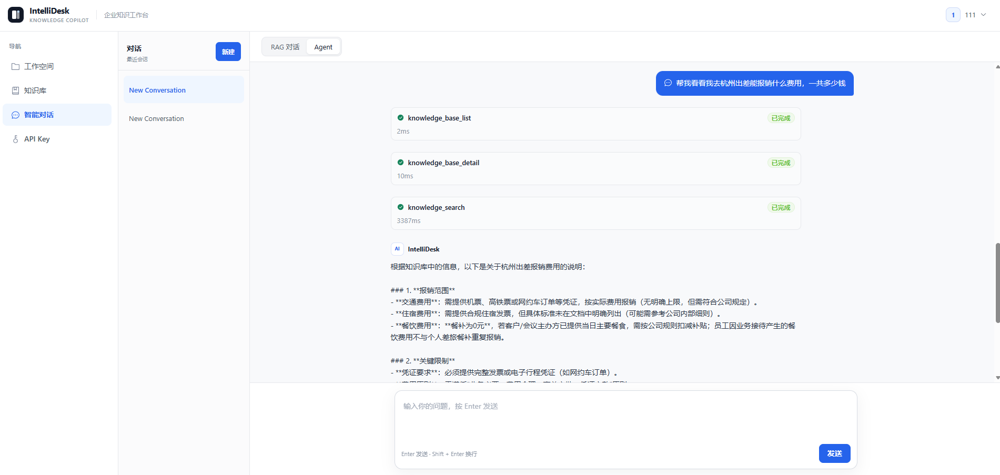
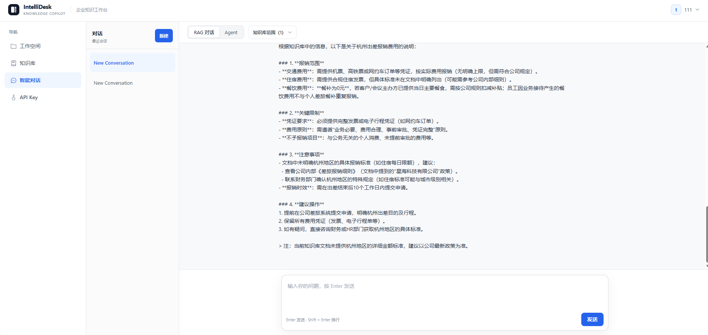
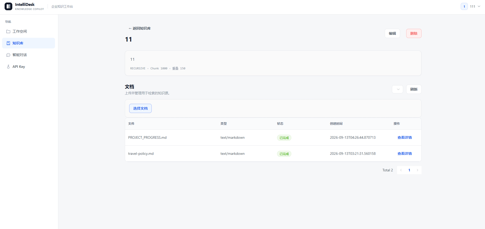
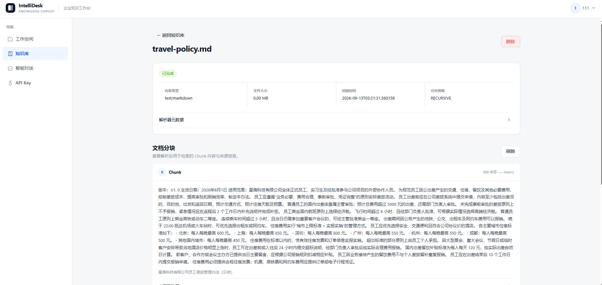
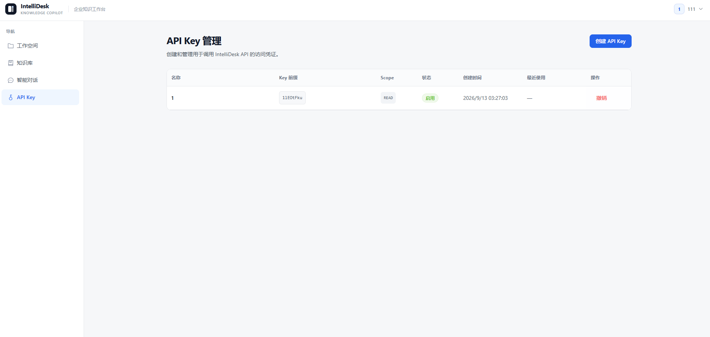

# IntelliDesk

> 企业知识库RAG与Tool-Calling Agent平台  
>  Spring Boot · Spring AI · pgvector · Elasticsearch · Vue3 · Ollama

IntelliDesk 是一个可本地运行的企业知识库、RAG 对话与工具调用 Agent 平台。项目重点不是功能数量，而是把异步文档处理、混合检索、安全边界、流式交互、失败恢复和可审计性能证据串成一套完整工程链路。前端采用中文优先的企业级 Knowledge Copilot 视觉语言，覆盖知识库管理、文档分块、可追溯问答、工具调用轨迹与 API Key 管理。

## 核心能力

- 工作空间与 RBAC：JWT access token、Redis refresh token rotation、owner/member 权限和跨工作空间 IDOR 防护。
- 文档摄入：TXT、Markdown、PDF 上传至 MinIO，经 RabbitMQ durable task 异步解析、分块、向量化并写入 PostgreSQL/pgvector 与 Elasticsearch。
- RAG：query rewrite、BM25、vector、RRF hybrid、可选 reranker、上下文构建、citation validation 与 SSE token streaming。
- Agent：有界 step/timeout、tool registry、参数校验、隔离执行、结果脱敏、调用轨迹和取消竞态保护。
- 工程能力：Redis Lua 原子限流、所有权 token 分布式锁、API key、Flyway、Docker Compose、Nginx、Prometheus 与 Grafana。
- 证据链：冻结语料与参数、raw-only 指标重算、immutable run-set、strict acceptance、失败注入矩阵和 secret scan。

## 架构与数据流

```text
Browser
  -> Nginx :80
     -> Vue 3 SPA
     -> /api -> Spring Boot
                  |-> PostgreSQL + pgvector
                  |-> Redis
                  |-> RabbitMQ -> document/retrieval consumers
                  |-> MinIO
                  |-> Elasticsearch
                  |-> OpenAI-compatible chat/embedding/rerank providers
                  `-> Actuator -> Prometheus -> Grafana
```

核心链路：

```text
Document: Upload -> MinIO -> durable DB task -> RabbitMQ -> parse -> chunk
          -> embedding -> pgvector + Elasticsearch -> READY

RAG: Query -> rewrite -> BM25 + vector -> RRF -> optional rerank
     -> prompt/context -> LLM -> citation validation -> SSE

Agent: Query -> bounded loop -> tool selection -> validation/execution
       -> sanitized observation -> final answer -> SSE
```

详细设计见 [Architecture](docs/ARCHITECTURE.md)。

## 安全与可靠性

- 密码使用 BCrypt；API key 只在创建时返回一次完整值，数据库以唯一 prefix 定位候选并用 BCrypt 校验 secret。
- 前端仅在内存保存 access token；refresh token 使用 HttpOnly cookie，并执行 rotation/revocation。
- API key、workspace、knowledge base、document、conversation 与 Agent tools 都执行服务端作用域校验。
- 文档与检索任务使用状态守卫、generation、lease 和 fence token；重复消息、旧 worker 与非 owner lock release 不能覆盖当前状态。
- Provider、tool、SSE、RabbitMQ、Redis 和 evidence failure 都有 fail-closed 或明确记录的既有 fail-open 合同。
- 日志和证据不保存 bearer token、refresh token、完整 API key 或 provider secret。

## 技术栈

| 层级 | 技术 |
|---|---|
| Backend | Java 21, Spring Boot 3.5.8, Spring AI 1.1.2, MyBatis-Plus, Flyway |
| Data | PostgreSQL 16 + pgvector, Redis 7, Elasticsearch 8, RabbitMQ 3.13, MinIO |
| Frontend | Vue 3, TypeScript, Vite, Pinia, Element Plus |
| Delivery | Docker Compose, Nginx, Prometheus, Grafana |
| Verification | JUnit 5, Testcontainers, Vitest, k6, Python unittest |

## 本地启动

要求：Docker Desktop / Docker Engine、Docker Compose，以及可用的本地 provider 配置。复制模板并只在本机填写运行时秘密：

### Windows PowerShell

```powershell
if (-not (Test-Path .env)) {
    Copy-Item .env.example .env
}

docker compose --env-file .env -f deploy/docker-compose.yml up -d --build
docker compose --env-file .env -f deploy/docker-compose.yml ps
```

### Linux / macOS

```bash
[ -f .env ] || cp .env.example .env

docker compose --env-file .env -f deploy/docker-compose.yml up -d --build
docker compose --env-file .env -f deploy/docker-compose.yml ps
```

应用入口：

- Web：`http://localhost/`
- Prometheus：`http://localhost:9090/`
- Grafana：`http://localhost:3000/`

后端不映射 host port；浏览器 API 与 SSE 都经 Nginx `/api` 代理。不要提交 `.env`。

## 可重复 Demo 数据

服务 healthy 后，为每次演示选择一个新的安全 RunId。脚本只调用正式 public APIs，创建隔离用户、工作空间、知识库、已索引文档、RAG conversation 和只读 API-key metadata；输出 manifest 不含密码、token 或完整 API key。

Demo seed 脚本使用 PowerShell 7（`pwsh`），Windows、Linux 和 macOS 均可运行。

### Windows PowerShell

```powershell
$env:INTELLIDESK_DEMO_PASSWORD = '<choose-a-local-demo-password>'
pwsh ./deploy/demo-seed.ps1 -RunId portfolio-001
Remove-Item Env:INTELLIDESK_DEMO_PASSWORD
```

### Linux / macOS

```bash
export INTELLIDESK_DEMO_PASSWORD='<choose-a-local-demo-password>'
pwsh ./deploy/demo-seed.ps1 -RunId portfolio-001
unset INTELLIDESK_DEMO_PASSWORD
```

相同 RunId 再次执行会 fail closed；换一个 RunId 可得到另一套独立数据。受控 fixture 位于 [demo-knowledge.txt](docs/demo/demo-knowledge.txt)。

## 项目截图

以下图片来自当前真实本地 UI。截图仅展示既有演示数据，未包含 token、密码、Authorization、cookie 或完整 API Key；API Key 页面只显示不可用于认证的 prefix。

### 智能对话与工具调用轨迹

RAG 与 Agent 共用统一的对话工作区，展示知识库范围、用户/AI 消息层级、检索工具执行状态和现代 Chat Composer。回答通过真实 SSE 连接增量呈现。





### 知识库与文档管理

知识库详情集中展示分块策略、文档处理状态与主要操作，弱化次要 metadata。



### 文档详情与 Chunk

文档详情保留解析状态、文件 metadata、分块策略以及实际用于检索的 Chunk 内容。



### API Key 管理

开发者 Console 风格的凭证列表只展示名称、prefix、scope、状态和使用时间，完整 secret 仍只在创建瞬间返回一次。



## 验证状态

公开版代表性验证汇总：

| Surface | Result |
|---|---|
| Backend | 973 tests, 0 failures, 0 errors, BUILD SUCCESS; 22 conditional skips |
| Provider HTTP adapter | localhost deterministic fixture 8/8 PASS, no skip |
| Frontend | 18 files / 92 tests PASS; production build PASS |
| Benchmark tooling | 181/181 PASS |
| Failure matrix | 7/7 areas closed; BLOCKER=0 / MUST_FIX=0 / TEST_GAP=0 |

这些是受控本地验证结果，不是生产 SLA。

## Evaluation、Benchmark 与 Failure Evidence

- [RAG Evaluation Report](docs/evaluation/report.md)：14 个受控合成文档、42 chunks、69 个 final questions；真实本地 embedding/BM25/reranker 路径。`HYBRID_RERANK` 在当前受控语料上的结果低于 `HYBRID`，不宣称 reranker 带来提升。
- [Benchmark Report](docs/benchmark/report.md)：7/7 mandatory scenarios strict accepted，1,691,143 个 authoritative samples/executions，0 authoritative errors；failed/diagnostic run-set 不进入结果。
- Failure Testing：覆盖 provider、SSE、Rabbit/document/retrieval、Redis/lock、auth/IDOR、Agent 与 evidence fail-closed 路径；公开仓库保留相关源码和测试，不包含大规模执行历史。

限制：benchmark 为 controlled-local baseline；RAG Pipeline、RAG Completion 与 Agent Tool Flow 的 deterministic provider-boundary stub 只测系统 pipeline；Document Processing 为 20 executions/run，其 p99 不是高置信度生产尾延迟；完整限制以上述报告与说明为准。

完整验证与历史证据保留于本地归档，公开仓库仅保留源码、方法说明与代表性结果。

## 项目结构

```text
IntelliDesk/
├── backend/                 # Spring Boot application and tests
├── frontend/                # Vue application and Vitest suites
├── deploy/                  # Compose, Nginx, observability, E2E/demo scripts
├── scripts/benchmark/       # Freeze, launcher, finalizer, strict acceptance
├── scripts/evaluation/      # Corpus freeze and baseline verification
├── docs/evaluation/report.md # Representative RAG evaluation result
├── docs/benchmark/report.md # Representative benchmark result
├── docs/demo/               # Demo fixture and real UI screenshots
└── docs/ARCHITECTURE.md      # Current architecture and security design
```

## 当前状态与边界

本公开版本对应已完成的 Phase 7 与 Phase 8 工程快照；大规模 raw、run-set、manifest 和历史评审记录未收入公开仓库。
