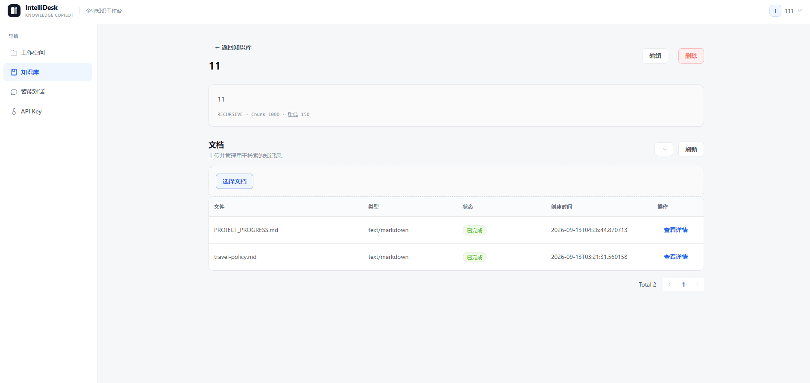
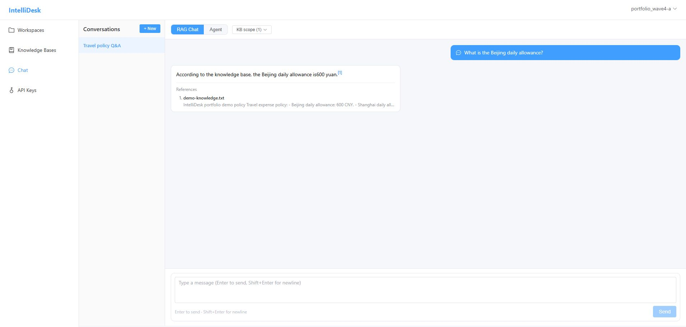

# IntelliDesk

**企业文档管理与智能服务平台**

## 项目简介

IntelliDesk 是基于 Spring Boot 构建的企业文档管理与智能服务平台，围绕用户认证、工作空间权限、文档管理、异步任务、缓存与检索等业务能力，集成 RAG 与智能问答功能。后端采用 Java 模块化单体架构，通过 Spring Security、PostgreSQL、Redis 与 RabbitMQ 协调权限、数据与任务处理；Vue 前端提供文档管理、对话和引用来源等交互。

## 系统架构

~~~text
Vue 3 → Nginx → Spring Boot
                  ├─ Spring Security / JWT / RBAC / workspace authorization
                  ├─ PostgreSQL + MyBatis-Plus：业务数据、持久化任务、pgvector
                  ├─ RabbitMQ：文档任务、延迟重试、DLQ
                  ├─ Redis：refresh token、限流、知识库元数据 Cache Aside
                  ├─ MinIO：文档对象
                  ├─ Elasticsearch：BM25 检索索引
                  └─ Spring AI：聊天模型、Embedding 与现有 RAG / Agent
~~~

详见[架构说明](docs/ARCHITECTURE.md)与[后端工程说明](docs/backend/BACKEND_ENGINEERING_REPORT.md)。应用采用模块化单体架构，数据库、消息队列和对象存储作为独立基础设施。

## 核心后端能力

| 能力 | 实际实现 |
| --- | --- |
| 认证与授权 | Spring Security、JWT、BCrypt、数据库 RBAC、工作空间成员/owner 校验、API Key scope |
| 异步任务 | 持久化 DocumentTask、手动 ACK、publisher confirm/return、延迟重试与 DLQ |
| 状态与事务 | 状态机、task status/attempt CAS、document version CAS、并发冲突回滚 |
| 缓存 | 小型 KB metadata Cache Aside、授权先于缓存读取、提交后失效、Redis 故障回退 |
| 数据访问 | PostgreSQL、MyBatis-Plus、唯一约束、租约扫描联合索引与真实 EXPLAIN |
| 可观测性 | HTTP → 持久化 task → MQ TraceId/MDC、安全的统一响应与异常摘要 |

## 文档处理流程

~~~text
上传并授权 → MinIO → 持久化 PENDING 任务 → MQ / dispatcher
    → 原子 claim PROCESSING → 事务外解析与分块
    → 同一 DB 事务保存 Chunk、SUCCEEDED / COMPLETED 和 retrieval task
    → 独立检索任务完成 Embedding / Elasticsearch 索引
~~~

解析分块完成与检索索引 READY 是两个独立阶段。外部存储、模型与索引调用位于数据库事务之外，由持久化任务与补偿流程协调恢复。

## 安全与权限

JWT 校验签名、到期时间、access 类型和必要身份字段；请求的角色权限从数据库读取，撤权不依赖等待旧 JWT 到期。全局 ADMIN/MEMBER 权限再叠加 workspace member/owner 检查；API Key 同时受 scope 约束。

密码使用 BCrypt；完整 API Key 仅创建时返回一次，后续展示 metadata。LLM 不参与授权。真实凭证只放本地环境配置，不进入 Git、日志示例或截图。

## 异步任务与消息可靠性

- 持久化 exchange/queue，mandatory 发布、confirm/return 检查，consumer 手动 ACK。
- 默认重试队列 TTL 为 30 秒；默认 3 次是总尝试数，不是额外重试 3 次。
- 临时失败进入 RETRY_WAIT；耗尽后 DEAD，保留 DLQ 诊断，不自动无界重放。
- 消息身份与数据库 taskId、documentId、messageId 一致后才处理；状态/attempt 条件更新和 document version CAS 防止竞争提交。

**成功提交后的重复投递可避免再次处理；提交前故障仍可能重新执行。** 数据库唯一约束、事务和 attempt fence 保护持久化结果，不承诺端到端 exactly-once 或零消息丢失。

## Redis 缓存

仅缓存小型知识库元数据，key 包含 workspaceId 与 kbId，内容上限 8192 字符，TTL 为 300–360 秒。每次先查数据库授权，再读取缓存。MISS 回源；DB 写入提交后失效；未提交事务不填充缓存；Redis 异常回退数据库。

缓存采用最终一致性，仅保存元数据；最终权限判断、正文、模型答案和一次性凭证不进入该缓存。并发填充或失效延迟可能带来短暂陈旧数据。每个缓存项的 TTL 从最后一次写入 Redis 起计算，为 300–360 秒；DB 提交后失效与到期回源共同更新元数据。

## 数据库与事务

短事务协调 task/document claim、Chunk 保存与后续任务创建；状态竞争未获准时回滚关联更新。任务 claim 校验 status + attempt_count，文档保留 version CAS，防止旧执行者跨重试周期提交。

租约扫描使用 document_index_task(status, lease_until) 联合索引。[数据库分析](docs/backend/DATABASE_ACCESS_REVIEW.md)包含隔离 PostgreSQL 上 20,000 条合成任务的真实 EXPLAIN：索引支持状态等值、租约范围与排序，同时带来写入维护成本。唯一约束与分页索引共同支撑数据一致性和列表访问；单次查询计划用于分析访问路径，不作为吞吐指标。

## TraceId 与异常处理

入口限制 TraceId 字符和长度，将其关联到响应、持久化文档任务及 MQ 消费；MDC 同时带 task/document/message 标识，作用域结束恢复线程上下文。GlobalExceptionHandler 与文档异常摘要使用安全响应，避免回显外部异常正文或敏感机器路径。

TraceId 用于关联请求与异步任务日志，关联范围以实际持久化的 trace 信息为准。

## AI / RAG 能力

在企业文档管理和权限体系基础上，通过 Spring AI 接入 LLM 与 Embedding，融合 pgvector 与 Elasticsearch 构建混合检索及引用问答能力。智能服务模块复用工作空间授权和文档索引。

- Markdown、TXT、PDF 解析分块；Embedding 写入 pgvector，关键词索引写入 Elasticsearch。
- Vector、BM25、Hybrid + RRF；可选 Reranker，不保证排序一定改善。
- Query Rewrite、Context Builder（上下文构建）、Citation（引用校验）、SSE 增量回答。
- 有界 Agent 工具调用、参数校验、结果脱敏和可查看的工具轨迹。

现有[受控 RAG Evaluation](docs/evaluation/report.md)使用 **SYNTHETIC / FICTIONAL** 语料：14 份文档、42 个实际 Chunk、69 个问题，其中 60 个合格问题参与质量指标，9 个无相关证据问题单列。在这份受控语料上，**HYBRID_RERANK 低于 HYBRID**；BM25 的 chunk MRR 也高于 Hybrid，因此不能宣称 Hybrid + RRF 普遍更优。检索相关性指标不等于答案正确率。

项目包含受控 RAG Evaluation、Benchmark 和 Failure Testing；[代表性 Benchmark 报告](docs/benchmark/report.md)说明测量方法、适用范围与结果。不同语料与运行口径的指标需分别解读。

## 技术栈

| 类别 | 技术 |
| --- | --- |
| 后端 | Java、Spring Boot、Spring Security、MyBatis-Plus |
| 数据 | PostgreSQL、pgvector、Redis、Elasticsearch |
| 消息与存储 | RabbitMQ、MinIO |
| AI | Spring AI、Embedding、RAG、Agent |
| 前端 | Vue 3、TypeScript、Vite、Pinia、Element Plus |
| 工程与测试 | Docker Compose、Nginx、JUnit、Mockito、MockMvc、Testcontainers、Vitest、k6 |

## 测试

项目使用 JUnit 5、Mockito、MockMvc、Testcontainers 与 Vitest，覆盖以下行为：

- JWT / RBAC 与 workspace authorization。
- 事务回滚、任务状态迁移与并发状态保护。
- RabbitMQ retry / DLQ 与重复消息处理。
- Redis 缓存读写、授权检查与提交后失效。
- 前端认证、路由及核心交互。

测试范围、环境要求与详细验证记录见[后端工程说明](docs/backend/BACKEND_ENGINEERING_REPORT.md)。下列后端命令选择公开源码中的代表性测试；历史验证计数以报告标注的运行范围为准。

~~~powershell
# 后端单元测试：Java 21、Maven，在仓库根目录执行
mvn -f backend/pom.xml "-Dtest=JwtTokenProviderTest,DocumentTaskConsumerTest,KnowledgeBaseMetadataCacheTest" test

# 后端集成测试：启动 Docker，允许拉取 Testcontainers 镜像
mvn -f backend/pom.xml "-Dtest=DocumentTaskConcurrencyIntegrationTest,KnowledgeBaseRedisIntegrationTest,DocumentRabbitTopologyIntegrationTest" test

# 前端
cd frontend
npm ci
npm test -- --run
npm run build
~~~

完整后端测试入口为 `mvn -f backend/pom.xml test`；执行前按所选测试准备 HTTP provider fixture 或评测归档输入。上述定向命令不选择模型评测和 Benchmark harness；具体依赖见[公开测试入口与前提](docs/backend/BACKEND_ENGINEERING_REPORT.md#公开测试入口与前提)。

[非 LLM 性能准备](docs/backend/NON_LLM_PERFORMANCE_PREPARATION.md)提供受限只读脚本、离线检查和测量方法说明。

## 本地运行

准备 Docker Compose 和实际可用的聊天、Embedding Provider。只在尚无 .env 时复制模板，随后按本机服务填写；不要用模板覆盖现有真实配置。

~~~powershell
if (-not (Test-Path .env)) { Copy-Item .env.example .env }
docker compose --env-file .env -f deploy/docker-compose.yml up -d --build
~~~

Web 默认位于 http://localhost/，backend 在 Compose 内通过 Nginx 访问。环境项见[配置模板](.env.example)，聊天与 Embedding 模型按实际 Provider 配置。

前后端独立开发需要 Java、Maven、Node.js 与对应依赖服务；具体工具链要求以 backend/pom.xml 和 frontend/package.json 为准。先将自己的环境配置安全注入后端进程，再运行：

~~~powershell
mvn -f backend/pom.xml spring-boot:run
# 另一个终端，在 frontend 目录
npm ci
npm run dev
~~~

Vite 的 /api 代理默认指向 localhost:8080。生产部署仍需独立完成凭证、TLS、数据库迁移、网络隔离与实际工作负载验证。

## 项目界面

更多真实界面：[文档 Chunk](docs/demo/screenshots/document-detail-chunks.png)、[API Key metadata](docs/demo/screenshots/api-key-metadata.png)、[Agent 工具轨迹](docs/demo/screenshots/agent-tool-trace.png)。

## 设计边界

- RabbitMQ 重试采用重复投递下的幂等处理，不等同于端到端 exactly-once。
- 数据库事务限定于数据库内操作，外部存储与索引通过任务和补偿流程协调。
- Cache Aside 采用最终一致性；缓存项自最后一次写入起按 TTL 到期，并结合 DB 提交后失效更新。
- RAG 结果受检索、语料和模型能力影响；引用用于溯源，答案正确性需要独立验证。
- 受控合成语料用于展示与评测，结论以对应数据集和运行条件为边界。

完整验证与历史证据保留于本地归档，公开仓库仅保留源码、方法说明与代表性结果。
