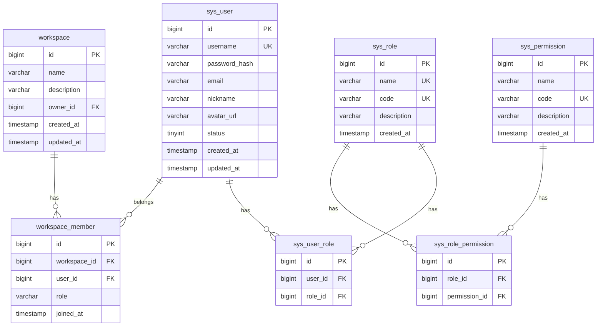
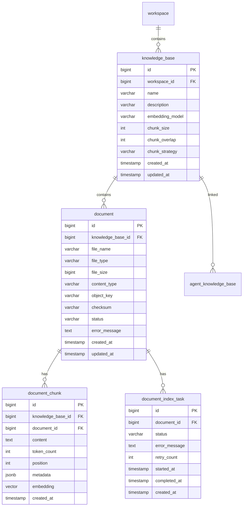
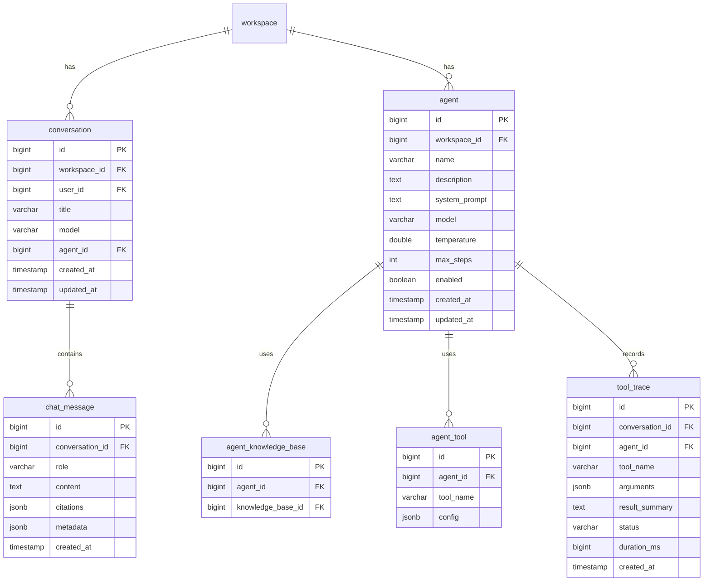
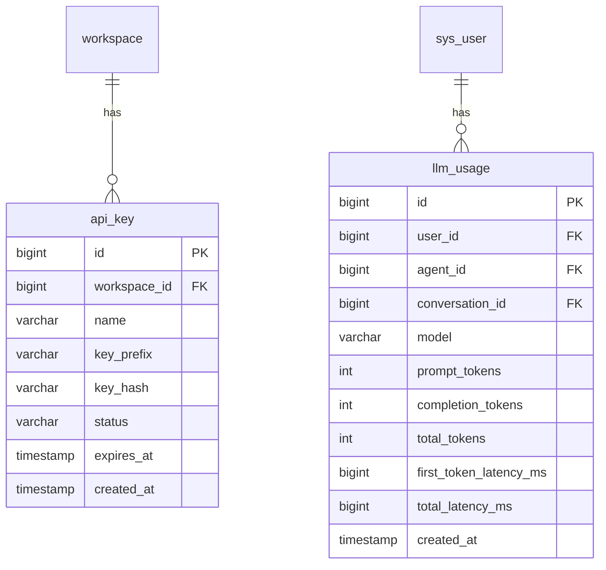
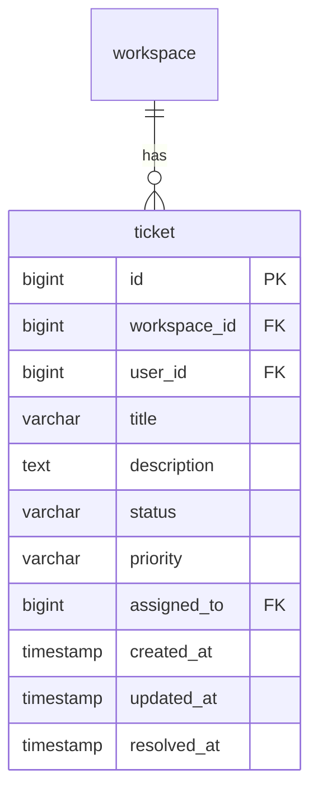

# IntelliDesk 架构设计文档

> Phase 0 设计输出，随项目推进持续更新。

---

## 一、技术选型与版本

| 组件 | 版本 | 说明 |
|------|------|------|
| Java | 21 LTS | 长期支持，虚拟线程 |
| Spring Boot | 3.5.8 | BOM 管理依赖 |
| Spring AI | 1.1.2 | 统一 AI 模型接入 |
| Spring AI Alibaba | 1.1.2.2 | 阿里云 AI 服务集成 |
| MyBatis-Plus | 3.5.x | 增强 MyBatis |
| PostgreSQL | 16 | 关系型数据库 |
| pgvector | 0.7.x | PostgreSQL 向量扩展 |
| Redis | 7.2 | 缓存 + 分布式锁 + 限流 |
| Elasticsearch | 8.x | 全文检索 + BM25 |
| RabbitMQ | 4.x | 异步文档索引 |
| MinIO | latest | S3 兼容对象存储 |
| Flyway | 10.x | 数据库迁移 |
| Maven | 3.9+ | 构建工具 |
| Vue 3 | 3.5+ | 前端框架 |
| Vite | 5.x | 前端构建 |
| Element Plus | 2.x | UI 组件库 |
| Docker | 26+ | 容器化 |
| Testcontainers | 1.20+ | 集成测试 |
| k6 | latest | 性能测试 |

> 以上版本基于 Spring AI Alibaba 官方稳定兼容关系确定，Phase 1 初始化时使用 BOM 统一管理。

---

## 二、系统架构

采用**模块化单体**架构，backend 内部按业务域分包。

```
┌─────────────────────────────────────────────────────┐
│                    Nginx (后期)                       │
├──────────────────────┬──────────────────────────────┤
│    Vue 3 Frontend    │    Spring Boot Backend        │
│    (Vite + Element)  │                                │
│                      │  ┌──────┐ ┌──────┐ ┌──────┐  │
│                      │  │ Auth │ │ User │ │Worksp│  │
│                      │  └──────┘ └──────┘ └──────┘  │
│                      │  ┌──────┐ ┌──────┐ ┌──────┐  │
│                      │  │Knowle│ │ Doc  │ │RAG   │  │
│                      │  └──────┘ └──────┘ └──────┘  │
│                      │  ┌──────┐ ┌──────┐ ┌──────┐  │
│                      │  │ Chat │ │Agent │ │Tool  │  │
│                      │  └──────┘ └──────┘ └──────┘  │
│                      │  ┌──────┐ ┌──────┐ ┌──────┐  │
│                      │  │Ticket│ │ LLM  │ │Usage │  │
│                      │  └──────┘ └──────┘ └──────┘  │
│                      │  ┌────────────────────────┐  │
│                      │  │   Infrastructure       │  │
│                      │  └────────────────────────┘  │
├──────────────────────┴──────────────────────────────┤
│                   Infrastructure                      │
│  ┌──────────┐ ┌───────┐ ┌──────────┐ ┌──────────┐  │
│  │PostgreSQL│ │ Redis │ │   MinIO  │ │ RabbitMQ │  │
│  │+pgvector │ │       │ │          │ │          │  │
│  └──────────┘ └───────┘ └──────────┘ └──────────┘  │
│  ┌──────────────┐                                    │
│  │Elasticsearch │                                    │
│  └──────────────┘                                    │
└─────────────────────────────────────────────────────┘
```

---

## 三、Backend Module 划分

```
backend/
└── src/main/java/com/intellidesk/
    ├── common/           # 通用: Result, ErrorCode, Exception, TraceId
    ├── auth/             # 认证: JWT, RefreshToken, Logout
    ├── user/             # 用户: 注册, 登录, RBAC
    ├── workspace/        # 工作空间: CRUD, 成员管理
    ├── knowledge/        # 知识库: KnowledgeBase CRUD
    ├── document/         # 文档: 上传, 解析, Chunk, IndexTask
    ├── retrieval/        # 检索: VectorRetriever, KeywordRetriever, Hybrid
    ├── rag/              # RAG: QueryRewrite, ContextBuilder, Citation
    ├── chat/             # 对话: Conversation, Message, SSE
    ├── agent/            # 智能体: Agent CRUD, AgentLoop
    ├── tool/             # 工具: ToolRegistry, ToolExecutor
    ├── ticket/           # 工单: Ticket CRUD
    ├── llm/              # LLM: 模型抽象, Usage 记录
    ├── usage/            # 用量: Token 统计, Dashboard
    └── infrastructure/   # 基础设施: Redis, MQ, MinIO, ES 配置
```

---

## 四、ER 设计

### 用户与权限



### 知识库与文档



### 对话与 Agent



### API Key 与用量



### 工单



---

## 五、API 设计

### 统一响应格式

```json
{
  "code": 0,
  "message": "success",
  "data": {},
  "traceId": "uuid"
}
```

### Phase 1 API 端点

| 方法 | 路径 | 说明 |
|------|------|------|
| POST | /api/auth/register | 注册 |
| POST | /api/auth/login | 登录 |
| POST | /api/auth/refresh | 刷新 Token |
| POST | /api/auth/logout | 登出 |
| GET | /api/users/me | 当前用户信息 |
| PUT | /api/users/me | 更新个人信息 |
| POST | /api/workspaces | 创建工作空间 |
| GET | /api/workspaces | 工作空间列表 |
| GET | /api/workspaces/{id} | 工作空间详情 |
| PUT | /api/workspaces/{id} | 更新工作空间 |
| DELETE | /api/workspaces/{id} | 删除工作空间 |
| POST | /api/workspaces/{id}/members | 添加成员 |
| DELETE | /api/workspaces/{id}/members/{userId} | 移除成员 |

### 后续阶段 API 端点（规划）

| 方法 | 路径 | 说明 | Phase |
|------|------|------|-------|
| POST | /api/knowledge-bases | 创建知识库 | 2 |
| GET | /api/knowledge-bases | 知识库列表 | 2 |
| POST | /api/knowledge-bases/{id}/documents | 上传文档 | 2 |
| GET | /api/retrieval/search | 混合检索 | 3 |
| POST | /api/chat/stream | 流式对话 | 4 |
| POST | /api/agents | 创建 Agent | 5 |
| POST | /v1/chat/completions | OpenAI-compatible API | 6 |

---

## 六、RAG Pipeline 设计

```
┌──────────────────────────────────────────────────────────┐
│                      RAG Pipeline                         │
│                                                           │
│  User Query                                               │
│      │                                                    │
│      ▼                                                    │
│  ┌──────────────┐                                         │
│  │ Query Rewrite │  ← 多轮对话上下文改写                    │
│  └──────┬───────┘     (可配置关闭)                         │
│         │                                                  │
│    ┌────┴────┐                                            │
│    ▼         ▼                                            │
│  ┌─────┐  ┌──────┐                                       │
│  │Vector│  │ BM25 │                                       │
│  │pgvec │  │  ES  │                                       │
│  └──┬──┘  └──┬───┘                                       │
│     │        │                                            │
│     └───┬────┘                                            │
│         ▼                                                 │
│  ┌──────────┐                                             │
│  │ RRF Fusion│  ← k=60 可配置                             │
│  └─────┬────┘                                             │
│        │                                                  │
│        ▼                                                  │
│  ┌──────────┐                                             │
│  │ Reranker │  ← Top 30 → Top 5~8                        │
│  └─────┬────┘                                             │
│        │                                                  │
│        ▼                                                  │
│  ┌────────────────┐                                       │
│  │ Context Builder │  ← Token Budget, 去重, Citation ID   │
│  └───────┬────────┘                                       │
│          │                                                │
│          ▼                                                │
│  ┌──────────┐                                             │
│  │   LLM    │  ← Prompt Template + Context + History      │
│  └─────┬────┘                                             │
│        │                                                  │
│        ▼                                                  │
│  ┌──────────┐                                             │
│  │ Citation │  ← documentId, chunkId, content, score      │
│  └─────┬────┘                                             │
│        │                                                  │
│        ▼                                                  │
│  ┌──────────┐                                             │
│  │   SSE    │  ← start → token → citation → done          │
│  └──────────┘                                             │
└──────────────────────────────────────────────────────────┘
```

### 数据流

```
文档上传 → MinIO → MQ → Parser → ChunkStrategy → EmbeddingService
                                                    ├── pgvector (向量)
                                                    └── Elasticsearch (BM25)
```

### 检索器接口

```java
public interface Retriever {
    List<RetrievalResult> retrieve(RetrievalQuery query);
}
```

实现：
- `VectorRetriever` — pgvector 向量检索
- `KeywordRetriever` — Elasticsearch BM25 检索
- `HybridRetriever` — RRF 融合

---

## 七、Agent Pipeline 设计

```
┌──────────────────────────────────────────────────────┐
│                    Agent Loop                         │
│                                                       │
│  User Message                                         │
│      │                                                │
│      ▼                                                │
│  ┌──────────┐                                         │
│  │  Agent   │  ← System Prompt + Tools + History      │
│  └────┬─────┘                                         │
│       │                                               │
│       ▼                                               │
│  ┌──────────┐    Yes    ┌──────────────┐             │
│  │ Need Tool?│─────────►│ Tool Registry │             │
│  └────┬─────┘           │ Tool Executor │             │
│       │ No              │ Tool Trace    │             │
│       │                 └──────┬───────┘             │
│       │                        │                      │
│       │                  Observation                  │
│       │                        │                      │
│       │◄───────────────────────┘                      │
│       │                                               │
│       ▼                                               │
│  ┌──────────┐                                         │
│  │  Answer  │  ← maxSteps / maxToolCalls / timeout    │
│  └──────────┘                                         │
└──────────────────────────────────────────────────────┘
```

### Tool Framework

```java
public interface AgentTool {
    String getName();
    String getDescription();
    JsonSchema getParametersSchema();
    boolean requiresConfirmation();
    ToolResult execute(ToolContext context);
}
```

第一版 Tool 列表：
- `searchKnowledge` — 知识库检索
- `getOrder` — 查询订单 (Mock)
- `getInventory` — 查询库存 (Mock)
- `getLogistics` — 查询物流 (Mock)
- `createTicket` — 创建工单
- `refundOrder` — 退款 (requiresConfirmation=true)

### 安全限制

- `maxSteps` — 最大推理步数
- `maxToolCalls` — 最大工具调用次数
- `timeout` — 总超时
- `requiresConfirmation` — 危险操作确认
- 工具参数校验

---

## 八、安全设计

| 层面 | 方案 |
|------|------|
| 认证 | JWT + Refresh Token (Redis) |
| 授权 | RBAC (ADMIN / MEMBER) |
| 密码 | BCrypt 哈希 |
| API Key | 唯一 prefix 定位候选 + BCrypt(secret) 校验；完整 key 仅创建时返回一次 |
| 限流 | Redis + Lua (用户级 / API Key 级) |
| 敏感信息 | .env 管理，不入 Git |
| CORS | Spring Security 配置 |
| Trace ID | 全链路追踪 |

---

## 九、Docker 架构

```
deploy/
├── docker-compose.yml
├── .env.example
├── postgres/
│   └── init.sql          # pgvector 扩展初始化
├── redis/
│   └── redis.conf
├── rabbitmq/
│   └── rabbitmq.conf
├── elasticsearch/
│   └── elasticsearch.yml
└── minio/
```

### 基础设施服务

```yaml
services:
  postgres:     # 5432
  redis:        # 6379
  rabbitmq:     # 5672, 15672 (management)
  elasticsearch:# 9200
  minio:        # 9000, 9001 (console)
```

---

## 十、开发路线图 Phase 1 实施计划

Phase 1 目标：完成基础后端，可运行、可测试、可验证。

### 步骤

1. **初始化 Maven 项目**
   - 创建 Spring Boot 项目骨架
   - 配置 pom.xml (Spring Boot, MyBatis-Plus, Flyway, PostgreSQL, Redis)
   - 配置 application.yml

2. **数据库 Migration (Flyway)**
   - V1__init_schema.sql — sys_user, sys_role, sys_permission, workspace 等表

3. **Common 模块**
   - Result<T> 统一响应
   - ErrorCode 枚举
   - GlobalExceptionHandler
   - TraceId 过滤器

4. **Auth 模块**
   - JWT 生成与验证
   - RefreshToken (Redis 存储)
   - Login/Logout/Refresh API

5. **User 模块**
   - Register API
   - 用户信息 API
   - RBAC 数据初始化

6. **Workspace 模块**
   - CRUD API
   - 成员管理

7. **测试**
   - Auth 单元测试
   - User 集成测试
   - Workspace 集成测试

8. **Docker 基础设施**
   - docker-compose.yml
   - 各服务配置

### 验收标准

```bash
# 编译通过
mvn clean compile

# 测试通过
mvn clean test

# 启动成功
mvn spring-boot:run

# API 验证
curl -X POST http://localhost:8080/api/auth/register
curl -X POST http://localhost:8080/api/auth/login
curl -X POST http://localhost:8080/api/auth/refresh
curl -X POST http://localhost:8080/api/workspaces
```
